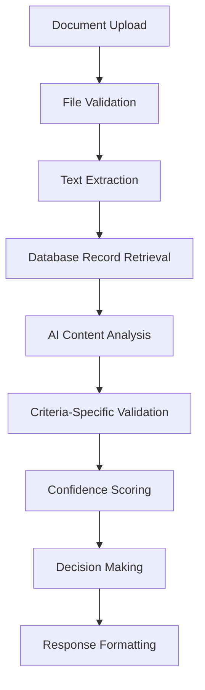
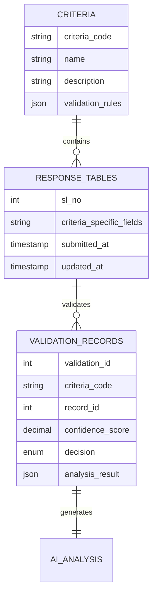

# 🎓 NAAC Validation System - Comprehensive Developer Guide

## 📋 Table of Contents
1. [System Overview](#-system-overview)
2. [Architecture Breakdown](#-architecture-breakdown)
3. [File Structure & Responsibilities](#-file-structure--responsibilities)
4. [How Validation Works](#-how-validation-works)
5. [Supported NAAC Criteria](#-supported-naac-criteria)
6. [Adding New Criteria](#-adding-new-criteria)
7. [Database Schema](#-database-schema)
8. [API Endpoints](#-api-endpoints)
9. [Testing & Debugging](#-testing--debugging)
10. [Deployment Guide](#-deployment-guide)

---

## 🎯 System Overview

The **NAAC Validation System** is a comprehensive document validation platform that validates uploaded documents against NAAC (National Assessment and Accreditation Council) criteria using AI-powered analysis. The system processes documents, extracts text using OCR, and validates content against database records using LLM-based intelligence.

### 🔧 **Core Components**
- **FastAPI Backend** - REST API server with validation endpoints
- **MySQL Database** - Stores NAAC criteria records for validation
- **AI Processing** - Groq LLaMA 3.1 for validation, Mistral AI for OCR
- **Document Processing** - Multi-format support (PDF, DOCX, XLSX)
- **Validation Engine** - Criteria-specific validation rules and logic

### 🌟 **Key Features**
- ✅ **Multi-Criteria Support** - Supports 6+ NAAC criteria with extensible architecture
- ✅ **Smart OCR** - Handles scanned documents and images with Mistral Vision
- ✅ **Database Integration** - Validates against real institutional data
- ✅ **Confidence Scoring** - AI-powered confidence assessment (0.0-1.0)
- ✅ **Bulk Validation** - Process multiple records simultaneously
- ✅ **Simplified APIs** - Clean JSON responses for frontend integration

---

## 🏗️ Architecture Breakdown

```
┌─────────────────────────────────────────────────────────────┐
│                    CLIENT REQUEST                            │
│                  (Upload Document)                          │
└─────────────────────┬───────────────────────────────────────┘
                      │
┌─────────────────────▼───────────────────────────────────────┐
│                 FASTAPI SERVER                              │
│                   (app.py)                                  │
│  - File upload handling                                     │
│  - Request validation                                       │
│  - Response formatting                                      │
└─────────────────────┬───────────────────────────────────────┘
                      │
┌─────────────────────▼───────────────────────────────────────┐
│               DOCUMENT PROCESSOR                            │
│             (processors/ocr_processor.py)                   │
│  - Text extraction (PyMuPDF, pdfplumber)                  │
│  - OCR processing (Mistral AI Vision)                     │
│  - Image handling (PIL, EasyOCR)                          │
└─────────────────────┬───────────────────────────────────────┘
                      │
┌─────────────────────▼───────────────────────────────────────┐
│              VALIDATION ENGINE                              │
│        (validation/criteria/criteria_validator.py)         │
│  - Criteria-specific validation rules                      │
│  - Database record comparison                              │
│  - AI instruction generation                               │
└─────────────────────┬───────────────────────────────────────┘
                      │
┌─────────────────────▼───────────────────────────────────────┐
│               AI CONTENT VALIDATOR                          │
│           (validation/content_validator.py)                 │
│  - LLM-based document analysis                             │
│  - Confidence scoring                                      │
│  - Field matching and validation                          │
└─────────────────────┬───────────────────────────────────────┘
                      │
┌─────────────────────▼───────────────────────────────────────┐
│                DATABASE LAYER                               │
│                (config/database.py)                         │
│  - MySQL connection management                             │
│  - CRUD operations for criteria records                   │
│  - Transaction handling                                    │
└─────────────────────┬───────────────────────────────────────┘
                      │
┌─────────────────────▼───────────────────────────────────────┐
│                VALIDATION RESULT                            │
│              (JSON Response)                                │
│  - Confidence score                                        │
│  - Field-by-field analysis                                │
│  - Accept/Reject/Flag decision                            │
└─────────────────────────────────────────────────────────────┘
```

---

## 📁 File Structure & Responsibilities

### 🎯 **Core Application Files**

#### `app.py` - Main FastAPI Server
**Purpose**: Central API server handling all HTTP requests
**Key Functions**:
- File upload and processing endpoints
- Validation request routing
- Response formatting and error handling
- Health checks and system status

**Important Endpoints**:
```python
POST /validate-record              # Single record validation
POST /validate-all-records         # Bulk validation
POST /validate-record-simple       # Simplified single validation
POST /validate-all-records-simple  # Simplified bulk validation
POST /extract-text                 # Text extraction only
GET  /criteria                     # List supported criteria
GET  /records/{criteria_code}      # Get database records
```

#### `main.py` - Application Entry Point
**Purpose**: Alternative startup script with configuration
**Usage**: `python main.py` to start the server

### 🔧 **Validation Engine**

#### `validation/criteria/criteria_validator.py` - Core Validation Logic
**Purpose**: Manages criteria-specific validation rules and database integration

**Key Components**:
```python
class CriteriaValidator:
    # Predefined criteria configurations
    criteria_requirements = {
        "2.1.1": {
            "name": "Teaching staff appointments",
            "database_model": "response_2_1_1",
            "required_fields": ["programme_name", "year", "no_of_students"],
            "validation_rules": {...}
        },
        "3.1.1": {
            "name": "Research grants received", 
            "database_model": "response_3_1_1",
            "required_fields": ["name_of_project", "name_of_principal_investigator"],
            "validation_rules": {...}
        }
    }
```

**Key Methods**:
- `validate_criteria_document()` - Main validation entry point
- `add_criteria()` - Dynamically add new criteria
- `validate_any_criteria()` - Generic validation for unconfigured criteria
- `list_supported_criteria()` - Get all supported criteria

#### `validation/content_validator.py` - AI-Powered Content Analysis
**Purpose**: Handles LLM-based document validation using Groq LLaMA

**Core Functionality**:
- **AI Integration**: Connects to Groq API for intelligent analysis
- **Prompt Engineering**: Creates detailed validation prompts
- **Response Parsing**: Processes LLM JSON responses
- **Confidence Scoring**: Generates 0.0-1.0 confidence scores
- **Field Matching**: Compares document fields with database records

**Key Methods**:
```python
validate_with_database_record(criteria_code, database_record, extracted_text, ai_instructions)
_create_database_validation_prompt(criteria_code, database_record, extracted_text)
_parse_llm_response(response_text)
_make_decision(confidence_score)
```

### 📄 **Document Processing**

#### `processors/ocr_processor.py` - Multi-Format Text Extraction
**Purpose**: Handles all document text extraction with intelligent fallback

**Supported Methods**:
1. **Direct Text Extraction** - PyMuPDF, pdfplumber, PyPDF2
2. **AI OCR** - Mistral AI Vision for scanned documents
3. **Traditional OCR** - EasyOCR as backup
4. **Image Processing** - PIL for image handling

**Key Features**:
- **Smart Detection** - Automatically detects if OCR is needed
- **Quality Assessment** - Evaluates extraction quality
- **Multi-Engine Fallback** - Tries multiple extraction methods
- **Format Support** - PDF, DOCX, XLSX, images

### 🗄️ **Database Layer**

#### `config/database.py` - MySQL Integration
**Purpose**: Manages all database operations for NAAC records

**Core Operations**:
```python
class NAACDatabase:
    get_criteria_record(criteria_code, record_id)     # Get specific record
    get_records_by_criteria(criteria_code, limit)     # Get multiple records  
    search_records(criteria_code, search_params)      # Search with filters
    get_database_status()                             # Health check
```

**Supported Tables**:
- `response_2_1_1` - Teaching staff data
- `response_3_1_1` - Research grants
- `response_3_2_1` - Publications/innovations
- `response_3_2_2` - Workshops/conferences
- `response_3_3_1` - Research papers
- `response_3_4_1` - Extension activities

#### `config/settings.py` - Configuration Management
**Purpose**: Centralized configuration for database, AI services, and application settings

### 🛠️ **Validation Rules & Configuration**

#### `config/validation_rules.json` - Validation Configuration
**Purpose**: JSON-based configuration for validation rules, file requirements, and confidence factors

**Structure**:
```json
{
    "file_validation": {
        "max_size_mb": 5,
        "allowed_formats": ["pdf", "xlsx", "doc", "docx"]
    },
    "criteria_validation": {
        "3.1.1": {
            "required_fields": ["project_name", "pi_name", "amount"],
            "validation_rules": {"min_amount": 1000}
        }
    },
    "confidence_factors": {
        "exact_match": {"project_name": 0.3, "pi_name": 0.3}
    }
}
```

### 🔍 **File Validators**

#### `validators/file_validator.py` - File Format Validation
**Purpose**: Validates uploaded files before processing
- File size limits
- Format restrictions
- Security checks
- Content type validation

#### `validators/base_validator.py` - Base Validation Classes
**Purpose**: Abstract base classes for all validators
- Common validation patterns
- Error handling standards
- Result formatting

### 📊 **Response Processing**

#### `response_simplifier.py` - API Response Formatting
**Purpose**: Converts complex validation results into clean, frontend-friendly JSON

**Key Functions**:
```python
format_api_response(original_response, validation_type)
simplify_bulk_validation_response(validation_results)
```

**Output Format**:
```json
{
    "data": {
        "summary": {...},
        "accepted_records": [...],
        "rejected_records": [...]
    },
    "details": {
        "validation_analysis": "...",
        "confidence_breakdown": "..."
    }
}
```

### 🧪 **Testing & Debugging**

#### `debug_system.py` - Unified Diagnostics
**Purpose**: Comprehensive system diagnostics and testing
- Environment validation
- Package compatibility checking
- Database connectivity testing
- AI service initialization

#### `test_*.py` Files - Test Suite
- `test_database.py` - Database connection tests
- `test_validation.py` - Validation logic tests  
- `test_new_system.py` - End-to-end system tests

---

## ⚙️ How Validation Works

### 🔄 **Complete Validation Flow**



### 📝 **Step-by-Step Process**

#### 1. **Document Upload & Validation**
```python
# File validation (validators/file_validator.py)
- Check file size (max 5MB)
- Validate file format (PDF, DOCX, XLSX allowed)
- Security checks (no executable files)
- Content type verification
```

#### 2. **Text Extraction** 
```python
# OCR processing (processors/ocr_processor.py)
if document_is_text_based:
    text = extract_with_pymupdf() or extract_with_pdfplumber()
else:
    text = extract_with_mistral_ai_vision()
    
# Quality assessment
if quality_score < threshold:
    text = fallback_to_easyocr()
```

#### 3. **Database Record Retrieval**
```python
# Database operations (config/database.py)
if validation_type == "single":
    record = db.get_criteria_record(criteria_code, record_id)
else:
    records = db.get_records_by_criteria(criteria_code, limit=50)
```

#### 4. **AI Content Analysis**
```python
# Content validation (validation/content_validator.py)
prompt = create_validation_prompt(criteria_code, database_record, extracted_text)
ai_response = groq_client.chat.completions.create(
    model="llama-3.1-70b-versatile",
    messages=[{"role": "user", "content": prompt}]
)
validation_result = parse_ai_response(ai_response)
```

#### 5. **Criteria-Specific Validation**
```python
# Criteria validation (validation/criteria/criteria_validator.py)
criteria_info = get_criteria_requirements(criteria_code)
field_validation = check_required_fields(database_record, criteria_info["required_fields"])
rule_validation = apply_validation_rules(extracted_text, criteria_info["validation_rules"])
```

#### 6. **Decision Making & Confidence Scoring**
```python
# Decision logic
if confidence_score >= 0.8:
    decision = "ACCEPT"
elif confidence_score >= 0.5:
    decision = "FLAG_FOR_REVIEW" 
else:
    decision = "REJECT"
```

### 🎯 **AI Prompt Engineering**

The system uses sophisticated prompts to guide AI analysis:

```python
AI_VALIDATION_PROMPT = f"""
TASK: Validate NAAC criteria {criteria_code} document against database record

DATABASE RECORD:
{json.dumps(database_record, indent=2)}

DOCUMENT TEXT:
{extracted_text}

VALIDATION REQUIREMENTS:
1. Compare document content with database record
2. Check for exact matches in key fields
3. Assess document authenticity and completeness
4. Provide confidence score (0.0-1.0)

RESPONSE FORMAT (JSON ONLY):
{{
    "confidence_score": 0.85,
    "field_matches": {{
        "project_name": {{"found": true, "similarity": 0.9}},
        "pi_name": {{"found": true, "similarity": 0.8}}
    }},
    "validation_analysis": "Document matches database record well...",
    "decision_reasoning": "High confidence due to exact matches...",
    "recommendation": "ACCEPT"
}}
"""
```

---

## 🎯 Supported NAAC Criteria

### 📊 **Current Criteria Matrix**

| Criteria Code | Name | Database Table | Key Fields | Validation Focus |
|---------------|------|----------------|------------|------------------|
| **2.1.1** | Teaching staff joined | `response_2_1_1` | `programme_name`, `year`, `no_of_students` | Faculty appointments, joining dates |
| **3.1.1** | Research grants received | `response_3_1_1` | `name_of_project`, `name_of_principal_investigator`, `amount_sanctioned`, `name_of_funding_agency` | Grant details, PI verification, funding amounts |
| **3.2.1** | Publications/Innovations | `response_3_2_1` | `paper_title`, `author_names`, `journal_name`, `year_of_publication` | Publication authenticity, author verification |
| **3.2.2** | Research workshops | `response_3_2_2` | `title_of_workshop`, `number_of_participants`, `date_from`, `date_to` | Event details, participation records |
| **3.3.1** | Research papers published | `response_3_3_1` | `title_of_paper`, `name_of_journal`, `year_of_publication`, `impact_factor` | Paper citations, journal verification |
| **3.4.1** | Extension activities | `response_3_4_1` | `name_of_activity`, `number_of_beneficiaries`, `date_of_activity` | Community engagement, impact assessment |

### 🔧 **Criteria Configuration Details**

#### **Criteria 3.1.1 - Research Grants**
```python
"3.1.1": {
    "name": "Grants received from Government and non-governmental agencies",
    "database_model": "response_3_1_1",
    "required_fields": [
        "name_of_project",
        "name_of_principal_investigator", 
        "name_of_funding_agency",
        "amount_sanctioned",
        "year_of_award"
    ],
    "validation_rules": {
        "amount_sanctioned": "positive_number_crores",
        "year_of_award": "within_assessment_period"
    }
}
```

**Validation Logic**:
- ✅ **Project Name Matching** - Fuzzy string matching with 80%+ similarity
- ✅ **PI Name Verification** - Cross-reference with institutional records
- ✅ **Amount Validation** - Check sanctioned vs claimed amounts
- ✅ **Agency Verification** - Validate funding agency authenticity
- ✅ **Timeline Validation** - Ensure dates within assessment period

#### **Criteria 3.2.1 - Publications**
```python
"3.2.1": {
    "name": "Publications and innovations ecosystem",
    "database_model": "response_3_2_1", 
    "required_fields": [
        "paper_title",
        "author_names",
        "journal_name",
        "year_of_publication"
    ],
    "validation_rules": {
        "year_of_publication": "within_assessment_period"
    }
}
```

**Validation Logic**:
- ✅ **Title Verification** - Exact and fuzzy matching
- ✅ **Author Authentication** - Institutional affiliation check
- ✅ **Journal Validation** - Cross-reference with UGC/Scopus lists
- ✅ **Publication Timeline** - Date consistency validation

### 🎯 **Validation Decision Matrix**

| Confidence Score | Decision | Action Required |
|------------------|----------|-----------------|
| **0.8 - 1.0** | **ACCEPT** | ✅ Automatic approval |
| **0.5 - 0.79** | **FLAG_FOR_REVIEW** | ⚠️ Manual review needed |
| **0.0 - 0.49** | **REJECT** | ❌ Automatic rejection |

---

## 🆕 Adding New Criteria

### 📝 **Method 1: Dynamic Addition (Runtime)**

```python
# Add new criteria via API
criteria_validator = CriteriaValidator()

success = criteria_validator.add_criteria(
    criteria_code="4.1.1",
    name="Infrastructure and Learning Resources", 
    database_model="response_4_1_1",
    required_fields=["facility_name", "capacity", "year_established"],
    validation_rules={
        "capacity": "positive_number",
        "year_established": "valid_year"
    }
)
```

### 📝 **Method 2: Configuration Update (Persistent)**

1. **Update `criteria_validator.py`**:
```python
# Add to criteria_requirements dict
"4.1.1": {
    "name": "Infrastructure and Learning Resources",
    "database_model": "response_4_1_1", 
    "required_fields": ["facility_name", "capacity", "year_established"],
    "validation_rules": {
        "capacity": "positive_number",
        "year_established": "valid_year"
    }
}
```

2. **Update `database.py`**:
```python
# Add to criteria_mapping
criteria_mapping = {
    # Existing mappings...
    "4.1.1": {"table": "response_4_1_1", "code": "040101"}
}
```

3. **Update `validation_rules.json`**:
```json
{
    "criteria_validation": {
        "4.1.1": {
            "name": "Infrastructure and Learning Resources",
            "required_fields": ["facility_name", "capacity"],
            "validation_rules": {
                "min_capacity": 10,
                "required_documents": ["infrastructure_report"]
            }
        }
    }
}
```

### 📝 **Method 3: Generic Validation (No Configuration)**

```python
# Use validate_any_criteria for unconfigured criteria
result = criteria_validator.validate_any_criteria(
    criteria_code="5.1.1",
    database_record=record,
    extracted_text=text,
    criteria_name="Student Support Services",
    required_fields=["service_name", "beneficiaries"]
)
```

### 🗄️ **Database Table Creation**

For each new criteria, create corresponding database table:

```sql
-- Example for criteria 4.1.1
CREATE TABLE response_4_1_1 (
    sl_no INT PRIMARY KEY AUTO_INCREMENT,
    facility_name VARCHAR(500),
    capacity INT,
    year_established YEAR,
    location VARCHAR(200),
    current_status ENUM('Active', 'Under Renovation', 'Inactive'),
    submitted_at TIMESTAMP DEFAULT CURRENT_TIMESTAMP,
    updated_at TIMESTAMP DEFAULT CURRENT_TIMESTAMP ON UPDATE CURRENT_TIMESTAMP
);
```

---

## 🗄️ Database Schema

### 📊 **Core Tables Structure**

#### `response_3_1_1` - Research Grants
```sql
CREATE TABLE response_3_1_1 (
    sl_no INT PRIMARY KEY AUTO_INCREMENT,
    name_of_project VARCHAR(500) NOT NULL,
    name_of_principal_investigator VARCHAR(200) NOT NULL,
    department_of_principal_investigator VARCHAR(200),
    name_of_funding_agency VARCHAR(300) NOT NULL,
    type_of_funding ENUM('Government', 'Non-Government') NOT NULL,
    amount_sanctioned DECIMAL(15,2) NOT NULL,
    year_of_award YEAR NOT NULL,
    project_duration VARCHAR(50),
    project_status ENUM('Ongoing', 'Completed', 'Terminated'),
    submitted_at TIMESTAMP DEFAULT CURRENT_TIMESTAMP,
    updated_at TIMESTAMP DEFAULT CURRENT_TIMESTAMP ON UPDATE CURRENT_TIMESTAMP
);
```

#### `response_3_2_1` - Publications
```sql
CREATE TABLE response_3_2_1 (
    sl_no INT PRIMARY KEY AUTO_INCREMENT,
    paper_title VARCHAR(800) NOT NULL,
    author_names TEXT NOT NULL,
    journal_name VARCHAR(400) NOT NULL,
    year_of_publication YEAR NOT NULL,
    volume_issue VARCHAR(100),
    page_numbers VARCHAR(50),
    doi VARCHAR(200),
    indexed_in ENUM('Scopus', 'Web of Science', 'UGC Care', 'Other'),
    impact_factor DECIMAL(5,3),
    submitted_at TIMESTAMP DEFAULT CURRENT_TIMESTAMP,
    updated_at TIMESTAMP DEFAULT CURRENT_TIMESTAMP ON UPDATE CURRENT_TIMESTAMP
);
```

### 🔗 **Database Relationships**



---

## 🌐 API Endpoints

### 📝 **Core Validation Endpoints**

#### **Single Record Validation**
```http
POST /validate-record
Content-Type: multipart/form-data

file: document.pdf
criteria_code: "3.1.1"  
record_id: 123
```

**Response**:
```json
{
    "success": true,
    "message": "Validation completed",
    "data": {
        "validation_result": {
            "confidence_score": 0.87,
            "decision": "ACCEPT",
            "field_matches": {...},
            "ai_analysis": "Document matches database record with high confidence"
        }
    }
}
```

#### **Bulk Validation**
```http
POST /validate-all-records
Content-Type: multipart/form-data

file: document.pdf
criteria_code: "3.1.1"
confidence_threshold: 0.7
max_records: 10
```

**Response**:
```json
{
    "success": true,
    "message": "Bulk validation completed - 10 records processed",
    "data": {
        "bulk_validation_summary": {
            "total_records_checked": 10,
            "best_match_confidence": 0.89,
            "decision_breakdown": {
                "ACCEPT": 3,
                "FLAG_FOR_REVIEW": 2, 
                "REJECT": 5
            }
        },
        "best_match": {...},
        "top_matches": [...]
    }
}
```

### 🎯 **Simplified Endpoints (Clean JSON)**

#### **Simple Single Validation**
```http
POST /validate-record-simple
```

**Response**:
```json
{
    "data": {
        "summary": {
            "decision": "ACCEPT",
            "confidence": 0.87,
            "criteria_code": "3.1.1"
        },
        "result": {
            "project_match": true,
            "pi_match": true,
            "amount_match": true
        }
    },
    "details": {
        "validation_analysis": "Strong matches across all key fields",
        "confidence_breakdown": {...}
    }
}
```

#### **Simple Bulk Validation** 
```http
POST /validate-all-records-simple
```

**Response**:
```json
{
    "data": {
        "summary": {
            "total_records": 10,
            "accepted_count": 3,
            "rejected_count": 7
        },
        "accepted_records": [
            {"record_id": 1, "confidence": 0.89, "key_matches": [...]},
            {"record_id": 5, "confidence": 0.84, "key_matches": [...]}
        ],
        "rejected_records": [
            {"record_id": 2, "confidence": 0.45, "issues": [...]},
            {"record_id": 3, "confidence": 0.32, "issues": [...]}
        ]
    },
    "details": {
        "processing_info": {...},
        "confidence_analysis": {...}
    }
}
```

### 🔍 **Utility Endpoints**

#### **List Supported Criteria**
```http
GET /criteria
```

**Response**:
```json
{
    "supported_criteria": [
        {"code": "2.1.1", "name": "Teaching staff appointments", "required_fields": 3},
        {"code": "3.1.1", "name": "Research grants received", "required_fields": 5}
    ],
    "total_count": 6
}
```

#### **Get Database Records**
```http
GET /records/3.1.1?limit=5
```

**Response**:
```json
{
    "criteria_code": "3.1.1",
    "records": [
        {
            "sl_no": 1,
            "name_of_project": "AI Research Initiative",
            "name_of_principal_investigator": "Dr. John Smith",
            "amount_sanctioned": "5.00"
        }
    ],
    "count": 5
}
```

### 📊 **System Status Endpoints**

#### **Health Check**
```http
GET /health
```

#### **Database Status**  
```http
GET /database/status
```

#### **API Documentation**
```http
GET /docs                    # Swagger UI
GET /redoc                   # ReDoc
GET /api-docs-simple         # Simplified API docs
```

---

## 🧪 Testing & Debugging

### 🔧 **Debug System Usage**

```bash
# Run comprehensive system diagnostics
python debug_system.py

# Output includes:
✅ Environment Check
✅ Package Compatibility  
✅ Database Connectivity
✅ AI Service Status
✅ File Processing Test
```

### 📝 **Unit Testing**

```bash
# Test database connections
python test_database.py

# Test validation logic
python test_validation.py  

# End-to-end system test
python test_new_system.py

# Run specific criteria test
python -c "
from test_validation import test_criteria_validation
test_criteria_validation('3.1.1', 'sample_grant_document.pdf')
"
```

### 🛠️ **Manual Testing Workflow**

1. **Start Server**:
```bash
python app.py
# Server starts at http://localhost:8000
```

2. **Test Text Extraction**:
```bash
curl -X POST "http://localhost:8000/extract-text" \
  -F "file=@document.pdf" \
  -F "force_ocr=true"
```

3. **Test Single Validation**:
```bash
curl -X POST "http://localhost:8000/validate-record" \
  -F "file=@document.pdf" \
  -F "criteria_code=3.1.1" \
  -F "record_id=1"
```

4. **Test Bulk Validation**:
```bash
curl -X POST "http://localhost:8000/validate-all-records" \
  -F "file=@document.pdf" \
  -F "criteria_code=3.1.1" \
  -F "limit=10"
```

### 📊 **Monitoring & Logging**

The system provides comprehensive logging:

```python
# Log levels and locations
DEBUG   - Detailed execution flow
INFO    - Successful operations  
WARNING - Non-critical issues
ERROR   - Validation failures
CRITICAL- System failures

# Log files
app.log                    # Main application log
naac_validation.log        # Validation-specific log
diagnostic_results.json    # Debug system output
```

### 🎯 **Common Testing Scenarios**

#### **Test Case 1: Perfect Match Document**
```python
# Document with exact database record match
expected_result = {
    "confidence_score": 0.95,
    "decision": "ACCEPT",
    "field_matches": {"all": True}
}
```

#### **Test Case 2: Partial Match Document**
```python
# Document with some matching fields
expected_result = {
    "confidence_score": 0.65,
    "decision": "FLAG_FOR_REVIEW", 
    "field_matches": {"partial": True}
}
```

#### **Test Case 3: Non-Matching Document**
```python
# Document with no relevant matches
expected_result = {
    "confidence_score": 0.25,
    "decision": "REJECT",
    "field_matches": {"none": True}
}
```

---

## 🚀 Deployment Guide

### 📋 **Prerequisites**

```bash
# System Requirements
- Python 3.8+
- MySQL 8.0+
- 4GB RAM minimum
- 10GB storage space

# API Keys Required
- Groq API Key (for LLaMA validation)
- Mistral AI API Key (for OCR processing)
```

### ⚙️ **Environment Setup**

1. **Create Virtual Environment**:
```bash
python -m venv naac_env
cd naac_env/Scripts && activate  # Windows
source naac_env/bin/activate     # Linux/Mac
```

2. **Install Dependencies**:
```bash
pip install -r requirements.txt
```

3. **Configure Environment Variables** (`.env`):
```env
# Database Configuration
DB_HOST=localhost
DB_PORT=3306
DB_USER=naac_user
DB_PASSWORD=secure_password
DB_NAME=naac_validation

# API Keys
GROQ_API_KEY=your_groq_api_key
MISTRAL_API_KEY=your_mistral_api_key

# Application Settings  
DEBUG=False
LOG_LEVEL=INFO
UPLOAD_MAX_SIZE=5242880  # 5MB
```

### 🗄️ **Database Setup**

```sql
-- Create database
CREATE DATABASE naac_validation;

-- Create user with permissions
CREATE USER 'naac_user'@'localhost' IDENTIFIED BY 'secure_password';
GRANT ALL PRIVILEGES ON naac_validation.* TO 'naac_user'@'localhost';

-- Import table schemas
mysql -u naac_user -p naac_validation < database_schema.sql
```

### 🚀 **Production Deployment**

#### **Option 1: Direct Python Deployment**
```bash
# Production server with Gunicorn
pip install gunicorn
gunicorn -w 4 -k uvicorn.workers.UvicornWorker app:app --bind 0.0.0.0:8000
```

#### **Option 2: Docker Deployment**
```dockerfile
FROM python:3.10-slim

WORKDIR /app
COPY requirements.txt .
RUN pip install -r requirements.txt

COPY . .

EXPOSE 8000
CMD ["uvicorn", "app:app", "--host", "0.0.0.0", "--port", "8000"]
```

```bash
# Build and run
docker build -t naac-validation .
docker run -p 8000:8000 --env-file .env naac-validation
```

#### **Option 3: Nginx + Gunicorn**
```nginx
# /etc/nginx/sites-available/naac-validation
server {
    listen 80;
    server_name your-domain.com;

    location / {
        proxy_pass http://127.0.0.1:8000;
        proxy_set_header Host $host;
        proxy_set_header X-Real-IP $remote_addr;
        proxy_set_header X-Forwarded-For $proxy_add_x_forwarded_for;
    }
}
```

### 🔐 **Security Considerations**

```python
# Security measures implemented:
- File type validation and size limits
- SQL injection prevention (parameterized queries)
- API key encryption and secure storage
- Request rate limiting
- CORS policy configuration
- Input sanitization
- Secure file upload handling
```

### 📊 **Performance Optimization**

```python
# Performance enhancements:
- Database connection pooling
- Async/await patterns for I/O operations
- Caching of frequently accessed data
- Batch processing for bulk operations
- Optimized AI prompt engineering
- Efficient text extraction algorithms
```

### 🎯 **Monitoring & Maintenance**

```bash
# Health monitoring
curl http://localhost:8000/health

# Database status check
curl http://localhost:8000/database/status

# View system logs
tail -f app.log
tail -f naac_validation.log

# Performance monitoring
python debug_system.py
```

---

## 📚 Additional Resources

### 🔗 **API Documentation**
- **Swagger UI**: `http://localhost:8000/docs`
- **ReDoc**: `http://localhost:8000/redoc`
- **Simplified Docs**: `http://localhost:8000/api-docs-simple`

### 📖 **Configuration Files**
- `config/settings.py` - Application configuration
- `config/validation_rules.json` - Validation rules and criteria
- `requirements.txt` - Python dependencies
- `.env.example` - Environment configuration template

### 🛠️ **Development Tools**
- `debug_system.py` - Comprehensive diagnostics
- `response_simplifier.py` - JSON response formatting
- `json_simplifier.py` - Response structure examples
- `cleanup_project.py` - Project maintenance tool

### 📝 **Sample Documents**
- Create `test_documents/` folder with sample PDFs for each criteria
- Use realistic institutional data for testing
- Include both positive and negative test cases

---

## 🎉 Conclusion

This comprehensive NAAC Validation System provides a robust, scalable platform for document validation against institutional criteria. The modular architecture allows for easy extension to new criteria, while the AI-powered validation ensures accurate and consistent results.

**Key Strengths**:
- ✅ **Extensible Design** - Easy to add new criteria
- ✅ **AI Integration** - Smart document analysis
- ✅ **Clean APIs** - Frontend-friendly responses
- ✅ **Comprehensive Testing** - Built-in diagnostics
- ✅ **Production Ready** - Deployment guides included

For additional support or feature requests, refer to the detailed API documentation and test the system using the provided debug tools.

---

**Last Updated**: November 2025  
**Version**: 2.0  
**Maintainer**: NAAC DVV Development Team